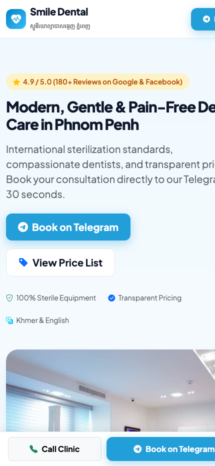

# 🦷 Smile Dental Studio — Phnom Penh

[](https://smile-dental-phnompenh.vercel.app/)
[](https://smile-dental-phnompenh.vercel.app/#booking)
[]()

> A modern, mobile-first clinic landing page featuring transparent pricing and automated background Telegram Bot appointment notifications.
> **Project 1** in the Client-Ready Portfolio Series for Cambodian Businesses.

🔗 **Live Production URL**: [https://smile-dental-phnompenh.vercel.app/](https://smile-dental-phnompenh.vercel.app/)

<div align="center">
  <br>
  
  <p><em>📱 Mobile UI Preview</em></p>
</div>

---

## 🌟 Overview & Case Study

### The Problem
Small businesses and medical/dental clinics in Cambodia often struggle with scattered customer inquiries on Facebook Messenger. Patients frequently ask the same repetitive questions (*"How much for scaling?"*, *"How much for whitening?"*), and receptionists miss leads during busy clinic hours.

### The Solution
A lightweight, high-converting landing page tailored for local clinics that:
1. **Displays transparent upfront pricing** to eliminate customer hesitation and reduce repetitive price inquiries.
2. **Features an automated Telegram booking engine** that sends instant notifications directly into the clinic staff's **Telegram supergroup** in the background.
3. **Delivers an app-like mobile experience** with one-tap calling, bilingual typography (English + Khmer), and zero loading lag.

---

## 🚀 Key Features

* **⚡ Secure Serverless Architecture**: Client frontend calls `/api/book` running on Vercel Serverless (Node.js). Zero API tokens or group IDs are exposed to the public browser.
* **🤖 Silent Background Telegram Bot API**: Submitting an appointment silently formats a clean Markdown card with patient name, phone, chosen treatment, and preferred time, pinging the staff group instantly.
* **🇰🇭 Bilingual Typography**: Powered by Google Fonts — **Plus Jakarta Sans** for modern international UI and **Kantumruy Pro** for clean Khmer text rendering.
* **📱 100% Mobile-First**: Built with a sticky bottom action bar (One-tap call + Telegram) optimized for Cambodian smartphone users (Smart, Cellcard, Metfone networks).
* **💎 Interactive Treatment Selector**: Clicking any service card automatically smooth-scrolls and pre-selects the treatment in the booking form.
* **✅ Feedback UI**: Displays dynamic loading spinners and an animated Bootstrap confirmation modal upon successful booking.

---

## 🛠️ Tech Stack

* **Frontend**: HTML5, CSS3, Bootstrap 5.3 (CDN)
* **Icons**: Bootstrap Icons
* **Typography**: Google Fonts (*Plus Jakarta Sans* & *Kantumruy Pro*)
* **Backend**: Vercel Serverless Function (`/api/book.js` on Node.js)
* **Third-Party API**: Telegram Bot API (`sendMessage` endpoint)
* **Hosting**: Vercel Global Edge Network ($0 cost, Free SSL)

---

## 📂 Project Structure

```text
smile-dental-phnompenh/
├── index.html           # Single-page client application with interactive booking logic
├── api/
│   └── book.js          # Secure serverless function (forwards bookings to Telegram)
├── .env.example         # Environment variable template
├── .gitignore           # Protects secret tokens from being committed
└── README.md            # Portfolio case study & documentation
```

---

## 💻 How to Run Locally

```bash
# 1. Clone the repository
git clone https://github.com/Sophireak/smile-dental-phnompenh.git

# 2. Enter directory
cd smile-dental-phnompenh

# 3. Open directly in browser (macOS)
open index.html
```

---

## ⚙️ Environment Variables (Vercel)

To route booking notifications to your own Telegram group, set these two environment variables in your **Vercel Project Settings > Environment Variables**:

| Variable | Description |
| :--- | :--- |
| `TELEGRAM_BOT_TOKEN` | Token provided by `@BotFather` (e.g. `123456:ABC-DEF...`) |
| `TELEGRAM_CHAT_ID` | Telegram Group ID (e.g. `-100xxxxxxxxxx`) or User ID |

---

## 👨‍💻 Developer & Portfolio

* **Developer**: Sophireak (bNha Web Developer)
* **Focus**: High-conversion business websites, appointment systems, and Telegram integrations for Cambodian SMEs.
* **Part of**: *Weekend Freelance Web Developer Roadmap (Project 1)*

[](https://smile-dental-phnompenh.vercel.app/)
